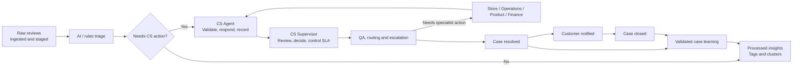

# Customer Service Cases — Product Plan

## Product outcome

The new page should become the operational layer between customer feedback and customer resolution:

- `/reviews` = raw incoming feedback
- `/processed` = tagged feedback and topic insights
- `/cases` = work that requires customer service action

A review can remain insight-only, or become a case when someone must respond, investigate, compensate, exchange, refund, or coordinate with another team.

## 1. Workflow translated from the reference



| Reference stage | System behavior |
|---|---|
| Pre-AI raw data lake | Preserve the original review, channel, timestamp, and source metadata as immutable evidence. |
| AI case triage | Determine whether the feedback needs individual action, suggest tags, priority, SLA, owner, and response direction. |
| CS Agent | Validate the recommendation, contact the customer, investigate, and create a complete case record. |
| CS Supervisor | Review difficult cases, assign ownership, approve exceptions, and monitor SLA performance. |
| Filter, QA & Escalation | Check evidence and policy compliance, then route the case to the correct team when CS cannot resolve it directly. |
| Resolved / Closed | Record the resolution, notify the customer, complete QA, and close the case. |
| Learning loop | Convert validated case outcomes into reusable issue, root-cause, resolution, and cluster signals. |

## 2. Case eligibility

The system should classify each processed review into one of three outcomes:

1. **Actionable case**
   Requires a response, investigation, exchange, refund, delivery follow-up, store intervention, or other individual action.

2. **Insight only**
   Useful for product, store, or experience analysis but does not require a customer-specific response.

3. **Needs review**
   The system cannot confidently determine whether action is required.

Examples:

- “Ukuran ini kapan restock?” → actionable case candidate.
- “Bahannya adem dan nyaman.” → insight only.
- “Barangnya bermasalah, tolong dibantu.” → needs agent clarification.
- Several reviews about the same product quality issue → individual cases plus an aggregated learning signal.

This distinction prevents every customer comment from becoming a support ticket while still making sure actionable feedback is not lost.

## 3. Customer Service Cases page

Add a new primary navigation item:

**Customer Service Cases**

The page should contain four main areas.

### A. Queue summary

At the top of the page:

- Open cases
- Needs triage
- SLA at risk
- Needs supervisor review
- Escalated cases
- Resolved this week

Each metric should be clickable and apply a filter to the case table.

### B. Case queues

Use queue tabs or saved views:

- All cases
- My queue
- Needs triage
- In progress
- Pending customer
- Pending internal / store
- Needs supervisor review
- Escalated
- Resolved
- Closed
- Reopened

### C. Case table

Recommended columns:

- Case ID
- Priority and SLA state
- Customer issue summary
- Original channel
- Brand / product
- Issue type
- Store or online
- Assigned agent or team
- Current status
- Last activity
- Created date

Useful filters:

- Case status
- Priority
- SLA health
- Assigned agent
- Assigned team
- Brand
- Product category
- Issue type
- Store
- Source channel
- Sentiment
- AI confidence
- Escalation status
- Created and updated date

The existing processed review table can provide the visual foundation for this table.

### D. Case detail view

Open a case in a drawer initially, with the option to promote it to a full detail route later.

Sections:

1. **Case header**
   - Case ID
   - Status
   - Priority
   - SLA countdown
   - Owner
   - Escalation indicator
   - Created and last-updated time

2. **Customer evidence**
   - Original statement
   - Linked review IDs
   - Source and channel
   - Feedback date
   - Related reviews
   - Related cases
   - Topic cluster

3. **AI triage**
   - Actionability recommendation
   - Suggested issue type
   - Suggested priority
   - Suggested owner/team
   - Suggested SLA
   - Possible duplicate cases
   - Confidence
   - Risk flags
   - Short explanation of the recommendation

4. **Case timeline**
   - Customer messages
   - Internal notes
   - Assignment changes
   - Status transitions
   - Supervisor decisions
   - Escalation events
   - Customer notifications

5. **Response and action panel**
   - Draft response
   - Response template
   - Internal action checklist
   - Add note
   - Record phone or chat interaction
   - Mark customer contacted
   - Assign to another team

6. **Resolution panel**
   - Resolution summary
   - Root cause
   - Action taken
   - Exchange, refund, voucher, or compensation details
   - Customer notification channel
   - Customer confirmation
   - Reopen reason
   - Learning tags

## 4. Case status model

Keep case workflow separate from review processing status and annotation review state.

Recommended lifecycle:

```text
Needs triage
  → In review
  → In progress
  → Pending customer
  → Pending internal / store
  → Escalated
  → Resolved
  → Closed
```

Additional transitions:

- `Reopened` → returns to `In progress`
- `Insight only` → remains outside the case workflow
- `Failed / invalid` → requires correction or removal from the operational queue

Rules:

- A case cannot be resolved without a resolution summary and action outcome.
- A case cannot be closed without recording whether the customer was notified.
- High-risk or high-value cases require supervisor approval.
- Escalated cases retain the original case owner and full history.
- Every status change records who changed it, when, and why.
- `Pending customer` pauses the resolution SLA according to policy.
- SLA warnings begin before the deadline; breaches automatically notify the supervisor.

## 5. Roles and responsibilities

### CS Agent

Can:

- Accept or reject a case candidate
- Validate AI-generated tags
- Edit issue, product, store, and sentiment fields
- Respond to the customer
- Add internal notes
- Assign or reassign within permitted teams
- Record resolution details
- Mark a case ready for supervisor or QA review

### CS Supervisor

Can:

- Review agent-created cases
- Override priority and SLA
- Approve refunds, exchanges, vouchers, or exceptions
- Reassign cases
- Escalate to another function
- Monitor aging and SLA breaches
- Approve resolution for sensitive cases

### QA / Escalation owner

Can:

- Check whether the case has sufficient evidence
- Confirm that the response follows policy
- Route cases to store, product, logistics, finance, or technology teams
- Return incomplete cases to the agent
- Approve closure

### Insights or system administrator

Can:

- Maintain taxonomy and routing rules
- Configure SLA policies
- Review case learning signals
- Inspect AI quality and audit history
- Manage role permissions

The current prototype uses anonymous/demo access, so the first version can simulate one role. The data model should still include ownership and permission fields so production roles can be added cleanly.

## 6. AI and automation responsibilities

Use the current rule-based processor as the first triage provider, behind an interface that can later be replaced by an AI service.

The triage output should include:

- `case_eligibility`
- `intent`
- `priority_suggestion`
- `sla_policy_suggestion`
- `suggested_team`
- `issue_type`
- `brand`
- `product_category`
- `store`
- `sentiment`
- `risk_flags`
- `possible_duplicate_case_ids`
- `response_draft`
- `confidence`
- `model_or_rule_version`

Human controls are required for:

- Sending a customer response
- Setting final priority on sensitive cases
- Promising compensation
- Closing a case
- Marking a case as insight-only
- Overriding AI tags
- Escalating or de-escalating a case

Suggested confidence behavior:

- High confidence: prefill the case and let the agent confirm.
- Medium confidence: require agent confirmation before routing.
- Low confidence: place the case in `Needs triage`.
- Safety, payment, legal, privacy, discrimination, or abuse signals: require supervisor review regardless of confidence.

AI must use the existing taxonomy and return `Unknown` or `Needs review` when evidence is insufficient. It should never invent an order number, store, customer detail, product, policy, or resolution.

## 7. Data model additions

The existing `ReviewRecord`, `Annotation`, `ProcessingRun`, and `AuditEntry` types can remain the foundation.

Add a `Case` record:

```text
id
status
priority
subject
review_ids
primary_review_id
customer_reference
source_channel
brand
product_category
issue_type
store_id
owner_user_id
owner_team
supervisor_user_id
sla_policy_id
first_response_due_at
resolution_due_at
first_response_at
resolved_at
closed_at
ai_triage
resolution
learning
created_at
updated_at
```

Add supporting records:

### `caseEvents`

An immutable audit trail for:

- Status changes
- Assignments
- Notes
- Escalations
- Supervisor decisions
- QA decisions
- Customer notifications

### `caseMessages`

Stores:

- Inbound customer messages
- Outbound responses
- Internal notes
- Channel
- Author
- Timestamp
- Delivery state

### `slaPolicies`

Defines:

- First-response target
- Resolution target
- Business hours
- Pause conditions
- Escalation thresholds
- Applicable priority or issue type

### `caseLearning`

Stores only validated outcomes:

- Root cause
- Resolution type
- Product or store signal
- Customer outcome
- Reopen indicator
- Reusable response pattern
- Related topic cluster
- Human validation status

A single case should support multiple linked reviews because a customer may follow up through several channels. The original review text must remain unchanged.

## 8. Learning loop

When a case reaches `Resolved` or `Closed`:

1. The agent records the resolution.
2. QA or a supervisor validates the outcome.
3. The system applies structured learning tags.
4. The case is linked to an existing topic cluster or creates a candidate for a new one.
5. The processed feedback page reflects the validated outcome.
6. Aggregated signals become available for product, store, service, and operations teams.

Examples of learning tags:

- Root cause: incorrect size chart
- Resolution: exchange approved
- Customer outcome: satisfied
- Operational owner: Store Operations
- Preventable issue: yes
- Repeated issue: yes
- Knowledge candidate: exchange policy explanation

Unvalidated AI suggestions should not be used as trusted learning data.

## 9. Implementation roadmap in the current app

### Phase 1 — Case foundation

- Add `/cases`
- Add `Case` and `CaseEvent` types
- Add Firestore/demo-store collections
- Add manual “Create case” action from a review
- Add case candidate classification
- Add case queue and filters
- Reuse existing catalogs and taxonomy values

### Phase 2 — Agent workflow

- Add case detail drawer
- Add ownership and team assignment
- Add timeline and internal notes
- Add response drafting and response logging
- Add status transitions
- Add audit entries
- Add linked reviews and related cases

### Phase 3 — Supervisor, SLA, and escalation

- Add priority and SLA policies
- Add countdown and aging indicators
- Add supervisor review queue
- Add escalation routing
- Add approval rules for refunds, exchanges, and sensitive cases
- Add SLA breach notifications in the workspace

### Phase 4 — Resolution and learning

- Add resolution and closure forms
- Add customer-notified requirement
- Add reopen flow
- Add QA approval
- Add validated case learning
- Link outcomes back to processed clusters

### Phase 5 — AI and channel integrations

- Replace or supplement rule triage with structured AI output
- Add duplicate detection
- Add response suggestions in the customer’s language
- Connect WhatsApp, social, email, phone, order, delivery, and store systems
- Add outbound response delivery and delivery status

## 10. Product success criteria

The first usable version is successful when:

- An agent can create a case directly from any review.
- The system can identify likely actionable feedback.
- The original customer statement remains visible and unchanged.
- An agent can validate tags, assign ownership, respond, and record actions.
- Supervisors can control priority, SLA, escalation, and exceptions.
- Every case action is auditable.
- A case cannot be closed without a documented resolution and notification state.
- Reopened cases retain their complete history.
- Resolved cases produce validated learning signals.
- Processed reviews and topic clusters remain the insight layer for patterns across cases.

## Current application fit

The repository already provides:

- `/reviews` for raw feedback
- `/processed` for tagged feedback and topic clusters
- Shared taxonomies for sources, brands, products, issues, stores, sentiment, and workflow values
- Rule-based processing with version metadata
- Review annotation editing and audit history
- Firebase/Firestore storage with a local demo-mode fallback

The main missing pieces are the case entity, case-specific workflow, assignments, SLA tracking, conversation timeline, supervisor controls, QA gates, and validated resolution learning.

Keep the existing annotation workflow separate from case workflow. The current `Annotation.workflow_status` can inform migration, but the durable case status should live on the case record because one case can contain multiple reviews and several customer interactions.
